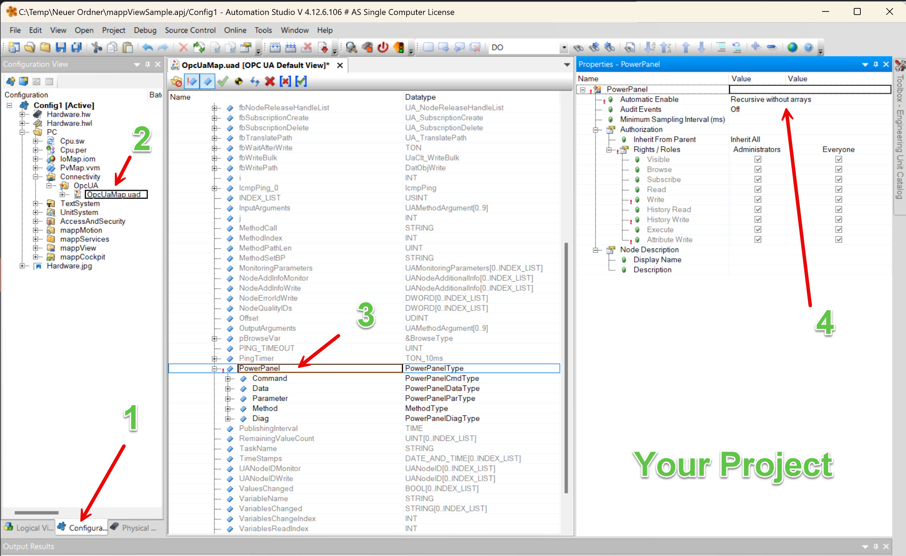
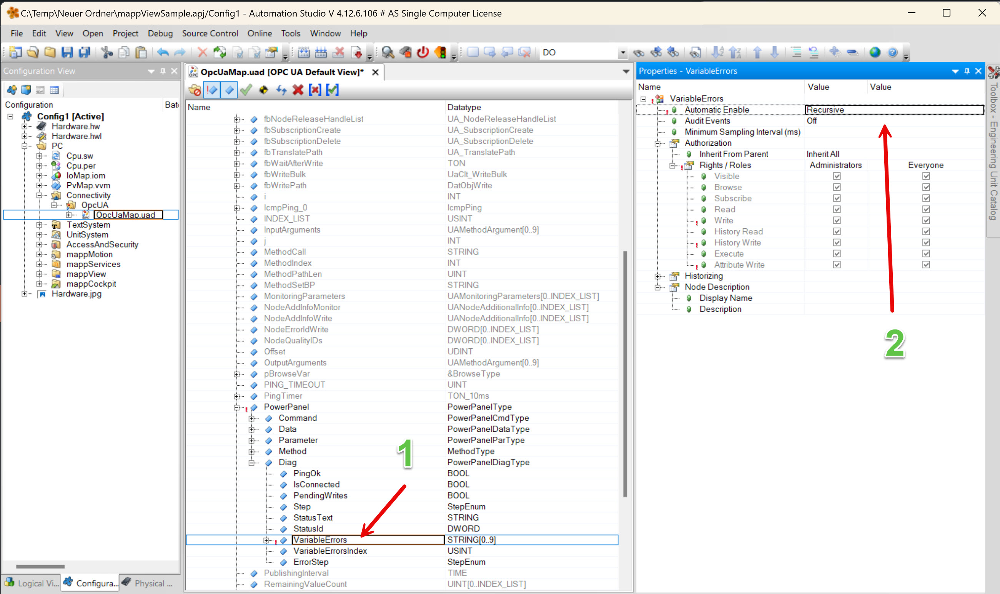

To import the project open your project and the sample project side by side. For this guide we assume that you already have mapView added to your project.

Copy and paste the package mappPanel from the sample into your project.

Copy and paste the mappView page mappPanel from the sample into your project. Add the page to your navigation page or add a button to navigate to the page.

* Switch to the configuration view
* Select your OPC UA configuration 
* Enable the variable 'PowerPanel'
* Select 'Recursive without arrays' for the property 'Automatic Enable'

* Expand the structure and select 'VariableErrors'
* elect 'Recursive' for the property 'Automatic Enable'

Copy and paste the files contentTPanel.binding and contentTPanel.eventbinding into your mappView package under the configuration view.

* Open the file 'Visualization.vis'
* Add the page pageTPanel, the binding contentTPanel_binding and the event bindinging contentTPanel_eventbinding

